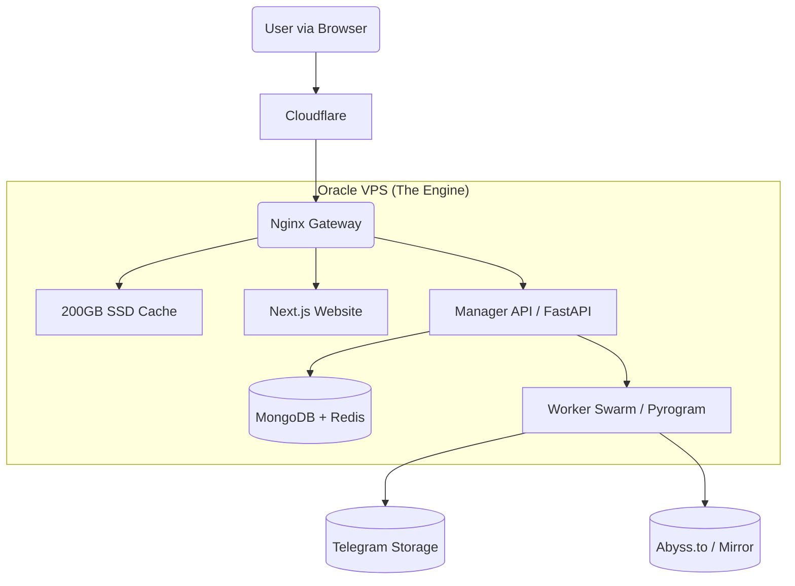

### 📄 File 1: `README.md`

# 🎬 StreamVault Ecosystem
> **The Zero-Cost Enterprise Streaming Network**  
> *Turning "Always Free" Cloud Infrastructure into a Netflix-Scale Streaming Service.*

  

---

## 📖 Executive Summary
StreamVault is not just a Telegram Bot. It is a **Microservices-based Content Delivery Network (CDN)** designed to host, index, and stream terabytes of video content using **Telegram** as the backend storage and **Oracle Cloud (Free Tier)** as the Delivery Engine.

Unlike standard bots that throttle users or get banned for flooding, StreamVault utilizes a **"Worker Swarm"** architecture and **Disk Caching** to serve thousands of concurrent users instantly, ensuring stability and revenue generation.

---

## 🏗️ System Architecture
The system runs on a **Single-Node Docker Swarm** (Docker Compose) on an Oracle Ampere A1 server (4 vCPU, 24GB RAM).



### The Three Pillars (Context Documentation)
*Detailed technical specs are separated into domain-specific documentation.*

| Module | Description & Link |
| :--- | :--- |
| **Backend & Infra** | **[See Context File: Infrastructure]** <br> Docker Compose, Nginx Caching Rules, Oracle Network Tunneling, Prometheus Monitoring. |
| **Frontend & UX** | **[See Context File: Frontend]** <br> Next.js Glassmorphism UI, Video Player, Magic Links, Ad-Integration. |
| **Bots & Telegram** | **[See Context File: Telegram]** <br> Manager Logic, Leech Ingestion, Worker Swarm Rotation, Abuse Handling. |

---

## ✨ Key Features (The Competitive Edge)

### 🤖 PART 1: The Automation Ecosystem(Bots)

<details>
    <summary><b>🧠 Manager Bot (The Brain / Admin Assistant)</b><br>
<i>This bot manages the database, user interactions, and gives orders to the swarm.</i></summary>

- [ ] **Magic Link Authenticator**
  Generates secure, time-limited JWT links (`/login`) for passwordless website access.<br>
  *Ensures high user conversion while keeping user privacy (no phone numbers sent to web).*

- [ ] **Metadata "Hoarder"**
  Silently scrapes TMDB/OMDB API via backend proxy to fetch high-res posters, plots, and ratings.<br>
  *Decouples the frontend from TMDB to prevent API key bans, creating a local metadata cache.*

- [ ] **Content "Cleaner" Indexer**
  Parses incoming filenames using `PTN`, strips garbage tags, and links files to TMDB Entities in MongoDB.<br>
  *Transforms "Avngrs.Endgm.mkv" into a structured "Avengers: Endgame (2019)" database entry.*

- [ ] **Global Kill Switch**
  Executes the `/takedown [ID]` command to instantly wipe content from DB, Nginx Cache, and Source Channels.<br>
  *A unified compliance tool to satisfy Oracle/DMCA abuse reports in seconds.*

- [ ] **Swarm Commander**
  Monitors the health of Worker Sessions; automatically routes traffic away from banned or "Flood Wait" accounts.<br>
  *Ensures 100% uptime by treating worker sessions as disposable resources.*

- [ ] **Alert & Broadcast Hub**
  Receives system alerts (Disk Full/High Load) and formats "New Release" cards for the Public Channel.<br>
  *Automates community management and server health monitoring from a private Admin chat.*

- [ ] **Broken Link "Medic"**
  Validates user-reported dead links via Head Request and triggers Auto-Repair (Re-Leech or Backup Swap).<br>
  *Turns user reports into automated maintenance actions without Admin intervention.*

- [ ] **Request & Wishlist Manager**
  Manages user requests in a queue and sends automated DMs when the requested content is added.<br>
  *Increases user retention by closing the loop on specific content demands.*

- [ ] **User Gatekeeper**
  Checks User status (Free vs. Banned) before generating stream tokens; manages anti-abuse policies.<br>
  *Protects the bandwidth usage from being exploited by bots or scraper scripts.*

- [ ] **Manual Override Console**
  Allows admin to use commands like `/edit` to fix metadata matches or manual entry correction.<br>
  *Provides a fallback for the 5% of automated matching errors.*

- [ ] **Ad-Link Generator**
  Integrates URL Shortener APIs (e.g., GPlinks) to convert standard stream links into monetized links before sending them to users.

- [ ] **Direct Forward Indexing**
  Instantly processes files "Forwarded" from other Telegram channels without downloading/leeching, creating a database entry in milliseconds.

</details>
---

<details>
   <summary><b> 🐝 Worker / Leech Bots (The Swarm)</b><br>
<i>These are the 10+ Physical SIM accounts processing heavy data.</i></summary>
<br>

- [ ] **Dual-Path Ingestion**
  Simultaneously processes video files for individual streaming AND generates pre-zipped archives for "Season Packs".<br>
  *Maximizes utility by using unlimited Telegram storage for two different download behaviors.*

- [ ] **Stream-Zipping Pipeline**
  Creates Zip files "On-The-Fly" (or uploads pre-zipped files) to bypass local disk storage limits.<br>
  *Allows users to download 50GB Season packs without filling the VPS hard drive.*

- [ ] **Multi-Source Mirroring**
  Uploads content to a Backup Host (Abyss.to / StreamWish) alongside Telegram Log Channels.<br>
  *Creates a RAID 1 style redundancy to survive a total Telegram Channel ban.*

- [ ] **Crowdsourced Ingestion Engine**
  Public-facing mode allowing users to send links/torrents to be downloaded to a "Dump Channel."<br>
  *Safe-quarantined staging area where users populate the library for you.*

- [ ] **Hash-Based Blocking**
  Calculates file hashes upon download and cross-references a blacklist to block illegal/CSAM content.<br>
  *Automated safety shield preventing severe abuse before it reaches the database.*

- [ ] **Queue Management System**
  Limits concurrent downloads to 5–10 items to protect VPS CPU/RAM from crashing.<br>
  *Standardizes load management for the Oracle Free Tier capabilities.*

- [ ] **Auto-Screenshot Extraction**
  Uses FFmpeg during download to capture frame snapshots at 10%, 50%, and 90%.<br>
  *Provides "Proof of Quality" images for the website, hosted invisibly on Telegram.*

- [ ] **Smart Renaming Engine**
  Interactively or automatically renames files before upload to remove AD domains or trash text.<br>
  *Ensures the private library remains clean and branded only with "StreamVault".*

- [ ] **Subtitle Stream Prober**
  Scans files during ingestion (using `ffprobe`) to detect embedded subtitle tracks and logs them for the Web Player to extract later.

- [ ] **Proxy/Network Tunneller**
  Configurable SOCKS5 support for workers to bypass ISP blocks or Region locks during downloads.

</details>
---

### 💻 PART 2: The User Experience (Frontend Website)
*The face of the product (`streamvault`), built with Next.js, Tailwind, and Glassmorphism.*

<details>
    <summary><b>🎨 Interface & Design</b></summary

- [ ] **Glassmorphism "Obsidian" UI**
  Deep dark mode (`#09090b`) with translucent glass layers, aurora gradients, and blur effects (`backdrop-blur-md`).<br>
  *A premium, app-like aesthetic using **Aceternity UI** components that differentiates it from cheap/spammy movie sites.*

- [ ] **Bento Grid Catalog**
  Modern grid layout for browsing content, mixing poster sizes and dynamic widgets.<br>
  *Replaces the standard boring "rows of posters" with a responsive, engaging layout similar to Apple TV/Netflix.*

- [ ] **Instant Search Dropdown**
  Search bar that queries the backend while typing, showing results with posters/year immediately in a glass panel.<br>
  *Reduces user friction by finding content instantly via MongoDB text search without page reloads.*

- [ ] **Metadata "Hero" Header**
  Full-width cinematic header for the movie page featuring the "Backdrop" image, title logo, rating pills, and cast info.<br>
  *Uses cached TMDB metadata to make the page look like a legitimate streaming service.*

- [ ] **Whitelabel Image Renderer**
  Proxies all images through `api.streamvault.net` instead of loading directly from Telegram or TMDB.<br>
  *Hides the technology stack (Telegram) from casual inspection or Ad network bots.*

</details>
---

<details>
    <summary><b>🎥 The Player Experience</b></summary>

- [ ] **Adaptive "Byte-Range" Player**
  HTML5 Player (ArtPlayer/Plyr) configured for HTTP 206 Streaming (Scrubbing/Seeking).<br>


---

This is the structured taxonomy for our documentation. Since we have successfully fixed **Phase 1 (V1)**, these context files now strictly define **Phase 2 (The Oracle Migration)**.

---

### 📂 Phase 2: The Enterprise Upgrade (Oracle Cloud)

#### 1️⃣ The Bedrock
*   **Filename:** `context_01_infrastructure.md`
*   **Phase Title:** **Phase 2.1: Cloud Infrastructure & Microservice Swarm**
*   **Role:** Defines the Oracle A1 VPS setup, Docker Compose architecture, Nginx Caching rules, Security tunnels (Cloudflare), and the Monitoring Stack (Grafana/Prometheus).

#### 2️⃣ The Engine
*   **Filename:** `context_02_telegram_logic.md`
*   **Phase Title:** **Phase 2.2: Telegram Ecosystem (Manager & Worker Swarm)**
*   **Role:** Defines the application logic—Manager Bot features (Auth, Abuse, Metadata), Worker Bot swarming (Load Balancing), Ingestion (Leeching/Zipping), and Database schemas (Mongo/Redis).

#### 3️⃣ The Interface
*   **Filename:** `context_03_frontend_ux.md`
*   **Phase Title:** **Phase 2.3: Web Experience & Monetization**
*   **Role:** Defines the Next.js visual layer—Glassmorphism UI, Video Player interactions, "Bucket" Downloads, Ad integration, and SEO automation.

---

### 📝 "Roadmap" section:

> **Phase 2: Oracle Cloud Migration (Active)**
> *   [📄 Blueprint 2.1: Infrastructure & Docker Architecture](./docs/v2_blueprint/context_01_infrastructure.md)
> *   [📄 Blueprint 2.2: Telegram Microservices Logic](./docs/v2_blueprint/context_02_telegram_logic.md)
> *   [📄 Blueprint 2.3: Frontend Web Experience](./docs/v2_blueprint/context_03_frontend_ux.md)

## 🚀 Deployment Guide (Zero to Hero)

### Prerequisites
1.  **Oracle Cloud Account:** Approved "Always Free" account (Home Region: Singapore/Frankfurt/Jeddah recommended).
2.  **Domain Name:** Linked to Cloudflare (e.g., `streamvault.xyz` or `.eu.org`).
3.  **Telegram Accounts:** 5-10 spare accounts (Physical SIM recommended).

### Step 1: Infrastructure Setup
```bash
# SSH into your new Oracle Instance
ssh ubuntu@your-ip-address

# Update & Install Docker
sudo apt update && sudo apt upgrade -y
curl -fsSL https://get.docker.com -o get-docker.sh
sh get-docker.sh
```

### Step 2: Deployment
```bash
# Clone the Repository
git clone https://github.com/YourRepo/streamvault.git /app/streamvault

# Configure Environment
cd /app/streamvault
cp .env.example .env
nano .env # (Paste your Bot Tokens, Mongo URL, TMDB Keys)

# Launch the Swarm
docker compose up -d --build
```

### Step 3: Initialization
1.  Send `/login` to your Manager Bot.
2.  Click the **Magic Link**.
3.  You are now the **Super Admin**. Access `streamvault.net/admin` to verify system health.

---

## ❓ Frequently Asked Questions (Business Risks)

**Q: Can Oracle delete my server?**
> A: As long as the server shows active usage (CPU/RAM > 10%), it is considered active. StreamVault's architecture ensures constant "Healthy Activity."

**Q: What happens if a DMCA notice arrives?**
> A: Use the `/takedown` command. It surgically removes the content from our Cache and Database. Reply to the email confirming removal. Do not ignore it.

**Q: How do I backup my database?**
> A: The system runs a daily Cron Job that dumps MongoDB data to a Private Telegram Channel. If the server dies, you can restore your library on a new VPS in minutes.

---

## 📜 License
*Proprietary Source-Available.*  
Designed for educational and research purposes.
```

---

### 🤖 File 2: `AI_GENERATION_PROMPT.md`

*Copy the text below when starting a new chat with an AI coder (ChatGPT/Claude/DeepSeek) to build this project.*

```markdown
# 🤖 System Prompt for StreamVault Development
**Role:** Senior DevOps Architect & Full-Stack Python Developer.
**Objective:** Assist the user in generating the code for "StreamVault," a high-scale Telegram Streaming Ecosystem hosted on Oracle Cloud.

---

### 1. THE CONTEXT (Your Brain)
The project is split into 3 distinct logical domains. The user will provide the specific **Context File** for the module we are currently building.
*   **Context_Infra:** Docker Swarm, Nginx Configs, Monitoring.
*   **Context_Frontend:** Next.js, Tailwind, Glass UI.
*   **Context_Telegram:** Pyrogram Bots, Ingestion Logic.

**Your constraints for every code generation:**
1.  **Architecture:** Always strictly follow the **"Manager -> Worker -> Storage"** separation. Never put download logic in the Manager Bot.
2.  **Platform:** Optimize for **Oracle Ampere A1 (ARM64)**.
    *   *Docker:* Use `linux/arm64` base images where applicable.
    *   *Threads:* Utilize the 4 cores via `asyncio` loop efficiency.
3.  **Storage:** All "Persistent" data (Sessions, DB, Cache) **MUST** allow mounting to the `/data` Host Volume.
    *   *Permission:* Ensure `Dockerfile` includes `RUN chown -R 1000:1000` logic.

### 2. CODE QUALITY RULES
*   **Tokens:** Be efficient. Do not explain basic concepts ("Here is how imports work"). Just output the solution.
*   **Placeholders:** Use `placehold.co` for images. Use `YOUR_IP` / `YOUR_TOKEN` for secrets.
*   **Error Handling:** Every API route must include a `try/except` block that fails gracefully (e.g., logging to Telegram Admin Channel instead of crashing stdout).

### 3. THE "BUSINESS" LOGIC (Implicit)
Always code with these business rules in mind:
*   **Safety:** Do not leak Telegram IPs. Use Nginx Proxying for images/video.
*   **Revenue:** Ensure logic exists to inject "Ad Scripts" or "Shortener Checks" in the download routes.
*   **Growth:** SEO Metadata (Sitemaps) should be auto-generated from DB.

---
