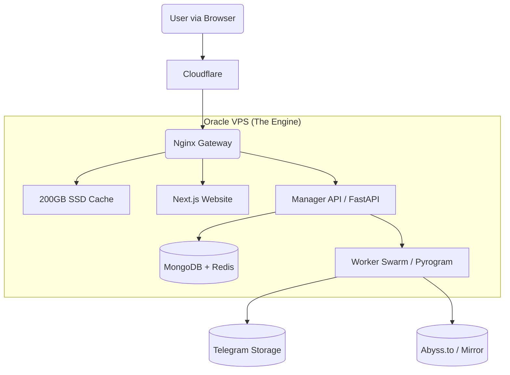

### 📄 File 1: `README.md`

# 🎬 StreamVault Ecosystem
> **The Zero-Cost Enterprise Streaming Network**  
> *Turning "Always Free" Cloud Infrastructure into a Netflix-Scale Streaming Service.*

  

---

## 📖 Executive Summary
StreamVault is not just a Telegram Bot. It is a **Microservices-based Content Delivery Network (CDN)** designed to host, index, and stream terabytes of video content using **Telegram** as the backend storage and **Oracle Cloud (Free Tier)** as the Delivery Engine.

Unlike standard bots that throttle users or get banned for flooding, StreamVault utilizes a **"Worker Swarm"** architecture and **Disk Caching** to serve thousands of concurrent users instantly, ensuring stability and revenue generation.

---

## 🏗️ System Architecture
The system runs on a **Single-Node Docker Swarm** (Docker Compose) on an Oracle Ampere A1 server (4 vCPU, 24GB RAM).



### The Three Pillars (Context Documentation)
*Detailed technical specs are separated into domain-specific documentation.*

| Module | Description & Link |
| :--- | :--- |
| **Backend & Infra** | **[See Context File: Infrastructure]** <br> Docker Compose, Nginx Caching Rules, Oracle Network Tunneling, Prometheus Monitoring. |
| **Frontend & UX** | **[See Context File: Frontend]** <br> Next.js Glassmorphism UI, Video Player, Magic Links, Ad-Integration. |
| **Bots & Telegram** | **[See Context File: Telegram]** <br> Manager Logic, Leech Ingestion, Worker Swarm Rotation, Abuse Handling. |

---

## ✨ Key Features (The Competitive Edge)

### 🤖 PART 1: The Automation Ecosystem(Bots)

<details>
    <summary><b>🧠 Manager Bot (The Brain / Admin Assistant)</b><br>
<i>This bot manages the database, user interactions, and gives orders to the swarm.</i></summary>

- [ ] **Magic Link Authenticator**
  Generates secure, time-limited JWT links (`/login`) for passwordless website access.<br>
  *Ensures high user conversion while keeping user privacy (no phone numbers sent to web).*

- [ ] **Metadata "Hoarder"**
  Silently scrapes TMDB/OMDB API via backend proxy to fetch high-res posters, plots, and ratings.<br>
  *Decouples the frontend from TMDB to prevent API key bans, creating a local metadata cache.*

- [ ] **Content "Cleaner" Indexer**
  Parses incoming filenames using `PTN`, strips garbage tags, and links files to TMDB Entities in MongoDB.<br>
  *Transforms "Avngrs.Endgm.mkv" into a structured "Avengers: Endgame (2019)" database entry.*

- [ ] **Global Kill Switch**
  Executes the `/takedown [ID]` command to instantly wipe content from DB, Nginx Cache, and Source Channels.<br>
  *A unified compliance tool to satisfy Oracle/DMCA abuse reports in seconds.*

- [ ] **Swarm Commander**
  Monitors the health of Worker Sessions; automatically routes traffic away from banned or "Flood Wait" accounts.<br>
  *Ensures 100% uptime by treating worker sessions as disposable resources.*

- [ ] **Alert & Broadcast Hub**
  Receives system alerts (Disk Full/High Load) and formats "New Release" cards for the Public Channel.<br>
  *Automates community management and server health monitoring from a private Admin chat.*

- [ ] **Broken Link "Medic"**
  Validates user-reported dead links via Head Request and triggers Auto-Repair (Re-Leech or Backup Swap).<br>
  *Turns user reports into automated maintenance actions without Admin intervention.*

- [ ] **Request & Wishlist Manager**
  Manages user requests in a queue and sends automated DMs when the requested content is added.<br>
  *Increases user retention by closing the loop on specific content demands.*

- [ ] **User Gatekeeper**
  Checks User status (Free vs. Banned) before generating stream tokens; manages anti-abuse policies.<br>
  *Protects the bandwidth usage from being exploited by bots or scraper scripts.*

- [ ] **Manual Override Console**
  Allows admin to use commands like `/edit` to fix metadata matches or manual entry correction.<br>
  *Provides a fallback for the 5% of automated matching errors.*

- [ ] **Ad-Link Generator**
  Integrates URL Shortener APIs (e.g., GPlinks) to convert standard stream links into monetized links before sending them to users.

- [ ] **Direct Forward Indexing**
  Instantly processes files "Forwarded" from other Telegram channels without downloading/leeching, creating a database entry in milliseconds.

</details>
---

<details>
   <summary><b> 🐝 Worker / Leech Bots (The Swarm)</b><br>
<i>These are the 10+ Physical SIM accounts processing heavy data.</i></summary>
<br>

- [ ] **Dual-Path Ingestion**
  Simultaneously processes video files for individual streaming AND generates pre-zipped archives for "Season Packs".<br>
  *Maximizes utility by using unlimited Telegram storage for two different download behaviors.*

- [ ] **Stream-Zipping Pipeline**
  Creates Zip files "On-The-Fly" (or uploads pre-zipped files) to bypass local disk storage limits.<br>
  *Allows users to download 50GB Season packs without filling the VPS hard drive.*

- [ ] **Multi-Source Mirroring**
  Uploads content to a Backup Host (Abyss.to / StreamWish) alongside Telegram Log Channels.<br>
  *Creates a RAID 1 style redundancy to survive a total Telegram Channel ban.*

- [ ] **Crowdsourced Ingestion Engine**
  Public-facing mode allowing users to send links/torrents to be downloaded to a "Dump Channel."<br>
  *Safe-quarantined staging area where users populate the library for you.*

- [ ] **Hash-Based Blocking**
  Calculates file hashes upon download and cross-references a blacklist to block illegal/CSAM content.<br>
  *Automated safety shield preventing severe abuse before it reaches the database.*

- [ ] **Queue Management System**
  Limits concurrent downloads to 5–10 items to protect VPS CPU/RAM from crashing.<br>
  *Standardizes load management for the Oracle Free Tier capabilities.*

- [ ] **Auto-Screenshot Extraction**
  Uses FFmpeg during download to capture frame snapshots at 10%, 50%, and 90%.<br>
  *Provides "Proof of Quality" images for the website, hosted invisibly on Telegram.*

- [ ] **Smart Renaming Engine**
  Interactively or automatically renames files before upload to remove AD domains or trash text.<br>
  *Ensures the private library remains clean and branded only with "StreamVault".*

- [ ] **Subtitle Stream Prober**
  Scans files during ingestion (using `ffprobe`) to detect embedded subtitle tracks and logs them for the Web Player to extract later.

- [ ] **Proxy/Network Tunneller**
  Configurable SOCKS5 support for workers to bypass ISP blocks or Region locks during downloads.

</details>
---

### 💻 PART 2: The User Experience (Frontend Website)
*The face of the product (`streamvault`), built with Next.js, Tailwind, and Glassmorphism.*

<details>
    <summary><b>🎨 Interface & Design</b></summary

- [ ] **Glassmorphism "Obsidian" UI**
  Deep dark mode (`#09090b`) with translucent glass layers, aurora gradients, and blur effects (`backdrop-blur-md`).<br>
  *A premium, app-like aesthetic using **Aceternity UI** components that differentiates it from cheap/spammy movie sites.*

- [ ] **Bento Grid Catalog**
  Modern grid layout for browsing content, mixing poster sizes and dynamic widgets.<br>
  *Replaces the standard boring "rows of posters" with a responsive, engaging layout similar to Apple TV/Netflix.*

- [ ] **Instant Search Dropdown**
  Search bar that queries the backend while typing, showing results with posters/year immediately in a glass panel.<br>
  *Reduces user friction by finding content instantly via MongoDB text search without page reloads.*

- [ ] **Metadata "Hero" Header**
  Full-width cinematic header for the movie page featuring the "Backdrop" image, title logo, rating pills, and cast info.<br>
  *Uses cached TMDB metadata to make the page look like a legitimate streaming service.*

- [ ] **Whitelabel Image Renderer**
  Proxies all images through `api.streamvault.net` instead of loading directly from Telegram or TMDB.<br>
  *Hides the technology stack (Telegram) from casual inspection or Ad network bots.*

</details>
---

<details>
    <summary><b>🎥 The Player Experience</b></summary>

- [ ] **Adaptive "Byte-Range" Player**
  HTML5 Player (ArtPlayer/Plyr) configured for HTTP 206 Streaming (Scrubbing/Seeking).<br>
  *Allows instant seeking (Start at 50:00) without buffering the whole file.*

- [ ] **Subtitle & Audio Selector**
  UI controls to toggle Soft Subtitles (`.vtt` via FFmpeg extraction) or select different Audio tracks if available.<br>
  *Accessibility features that match legitimate players, pulled dynamically from the file.*

- [ ] **Failover Backup Player**
  Embeds the Abyss.to/StreamWish player automatically if the Primary (Telegram) link returns a 404/Ban error.<br>
  *Ensures the user can always watch the movie, even if our primary storage takes a hit.*

- [ ] **Picture-in-Picture & Shortcuts**
  Supports native browser PiP mode and keyboard shortcuts (F for Fullscreen, Space to Pause).<br>
  *Standard quality-of-life features expected by modern web users.*

</details>
---

<details>
    <summary><b>📥 Interactions & Features</b></summary

- [ ] **Multi-Quality "Bucket" Modal**
  Download button opens a modal showing all linked versions (1080p, 720p, 480p) stored in the database.<br>
  *Gives users choice of file size without managing different pages for each version.*

- [ ] **Zip-Stream Download Button**
  One-click button for Seasons/Series that triggers the backend "On-the-Fly" or "Pre-Zipped" download stream.<br>
  *Massively convenient for downloading an entire season without 20 separate clicks.*

- [ ] **User Dashboard**
  Personalized glass panel showing "Continue Watching" history (Local Storage synced) and "Wishlist."<br>
  *Increases user retention by tracking progress, utilizing the Magic Link login system.*

- [ ] **QR / Magic Link Login UI**
  Page accepting JWT tokens (`/auth?token=...`) or displaying a dynamic QR code for mobile-to-TV login.<br>
  *A password-less, secure login flow that builds trust (Privacy First).*

</details>
---

<details>
    <summary><b>🛡️ Compliance & Safety Pages</b></summary>

- [ ] **Report "Broken" Modal**
  Diagnostic popup under the player allowing users to flag specific issues (Wrong File, No Audio, Dead Link).<br>
  *Connects directly to the "Broken Link Medic" bot to trigger automated repairs.*

- [ ] **DMCA / Legal Portal**
  Formal "ISP Safe Harbor" page allowing rights holders to submit claims (routed to Admin Telegram).<br>
  *Critical legal shield required to maintain good standing with Oracle and Ad Networks.*

</details>
---

<details>
    <summary><b>💰 Monetization</b></summary>

- [ ] **Ad-Block Bypass / Message**
  Subtle "Please turn off Adblock" toaster (Glass UI) if monetization scripts are blocked.<br>
  *Recover revenue without locking the user out completely (Soft Wall).*

- [ ] **Pop-Under & Shortener Integration**
  Logic that triggers a Pop-under ad on the "Play" click or forces a Shortener verification for large downloads.<br>
  *The core revenue drivers, implemented carefully to minimize user annoyance.*

</details>
---

### ⚙️ PART 3: Backend & Infrastructure (Oracle Cloud)
*The "Engine Room" running on the Ampere A1 (4 vCPU / 24GB RAM) Server.*

<details>
    <summary><b>🏗️ System Architecture</b></summary>

- [ ] **Docker Swarm (Compose) Ecosystem**
  Orchestration of 5+ isolated containers (Manager, Workers, DB, Nginx, Frontend) within the single VPS.<br>
  *Ensures zero-conflict updates; if the "Frontend" crashes, the "Bot" stays online.*

- [ ] **Nginx "Slice" Caching (200GB)**
  Configuration to cache video chunks (10MB slices) to the persistent block storage with "Inactive-Delete" rules.<br>
  *The core scalability engine: serves popular content from local disk (NVMe) to bypass Telegram limits.*

- [ ] **Hybrid Streaming Engine**
  FastAPI (Python) v1 deployment handling HTTP 206 Byte-Range requests for seeking/scrubbing.<br>
  *(Roadmap: Migrating the stream route to **Golang** in V2 for 10x concurrency per core.)*

- [ ] **Dual-Layer Database Cluster**
  **MongoDB** for persistent metadata (Movies/Files) and **Redis** for high-speed hot data (Session limits/Queue).<br>
  *Splits workload to ensure fast searching even with 50,000 files.*

- [ ] **Failover "RAID 1" Logic**
  Backend router that attempts to fetch from Telegram first, but auto-switches to Abyss.to/StreamWish if the Telegram ID fails (404).<br>
  *Prevents dead links on the frontend by verifying connectivity milliseconds before serving headers.*

</details>
---

<details>
    <summary><b>📊 Monitoring & Analytics</b></summary>

- [ ] **The "Cockpit" (Prometheus + Grafana)**
  Self-hosted monitoring stack visualizing real-time CPU, RAM, Network Bandwidth (TB usage), and Disk Space.<br>
  *Essential for tracking the 10TB bandwidth limit and alerting before the 200GB disk fills up.*

- [ ] **Custom Business Metrics**
  Middleware code injecting custom stats (Active Viewers, Cache Hit Ratio, Worker Health) into the Grafana dashboard.<br>
  *Moves beyond server stats to show business health ("How many people are watching?").*

- [ ] **Portainer Management UI**
  Web GUI for Docker management to restart containers, view raw logs, and manage images without SSH.<br>
  *Simplified day-to-day maintenance accessible from a mobile browser.*

</details>
---

<details>
    <summary><b>🛡️ Security & DevOps</b></summary>

- [ ] **Cloudflare DNS Proxy ("Orange Cloud")**
  Routes all domain traffic through Cloudflare to hide the Oracle Origin IP from DDoS attacks and Sniffers.<br>
  *Provides SSL, caching, and a layer of anonymity for the server location.*

- [ ] **GitHub Actions CI/CD**
  Automated pipeline: `git push` -> Auto-SSH into Oracle -> `docker compose rebuild` -> Notify Admin.<br>
  *Enables professional "Zero-Downtime" updates without manual file transfers.*

- [ ] **Encryption & "Clean" Logging**
  Optionally encrypting the storage volume (LUKS) and forcing error logs to hide Pyrogram/Telegram traces.<br>
  *Protects data privacy "At Rest" (Oracle policy) and "In Transit" (User inspection).*

- [ ] **VS Code Remote Tunnel**
  Development setup connecting the Oracle VPS directly to your local VS Code editor.<br>
  *Allows coding on the server as if it were your localhost.*

</details>
---

Here is the comprehensive feature list for **Project ReadVault**.

This list defines the **Lightweight/Stateless** architecture required to run on Hugging Face (Backend) and Vercel (Frontend), while ensuring future compatibility with the StreamVault Oracle merger.

---

### 📚 PART 1: The Automation Ecosystem (Bots)

<details>
   <summary><b>🧠 Manager Bot (ReadVault Admin)</b><br>
    <i>Role: Metadata management, User Search, and Command & Control.</i></summary>

- [ ] **Batch Ingestion Commander**
  Accepts direct URLs from aggregators (e.g., MangaDex, Manganato) or lists via `/batch` command to trigger bulk library population.<br>
  *Automates the population of thousands of chapters without manual admin input.*

- [ ] **Metadata Scraper (Books)**
  Queries MyAnimeList (MAL) and Google Books API to fetch Synopsis, Authors, and Tags, independent of the source file.<br>
  *Ensures the library looks professional with rich metadata, not just file names.*

- [ ] **"Peek" Search Responder**
  Handles user queries (`@Bot Solo Leveling`) and returns a "Preview Card" with the cover and a "Read on Website" button.<br>
  *Acts as a funnel to drive Telegram traffic directly to the Web Interface.*

- [ ] **Magic Link Authenticator**
  Generates `jwt_token` links (`/login`) to securely authenticate users on the website for tracking read progress.<br>
  *Standardized StreamVault-compatible auth system.*

- [ ] **Abuse & Takedown Protocol**
  Executes removal of content from MongoDB and Telegram based on ID/Hash in case of strict copyright reports.<br>
  *Protecting the repository and Telegram channels from bans.*
</details>
---

#### ➕ More Manager Bot Features
- [ ] **Manual Metadata Editor**
  `/edit [ID]` command allowing Admin to fix "False Matches" from MyAnimeList or update generic Book Covers manually.
  *Critical because automated scrapers often confuse "Light Novels" with "Manga" versions of the same title.*

- [ ] **Chapter Report Handler ("Medic")**
  Logic to receive "Broken Image / Missing Page" reports from the frontend and flag specific chapters for Re-Leeching.
  *Essential maintenance tool, as individual images in a Telegram Album can occasionally fail.*

---

<details>
   <summary><b>🚜 Worker Bot (The Librarian)</b><br>
<i>Role: Handling downloads (Gallery-DL/Scripts) and Telegram Uploads.</i></summary>

- [ ] **Gallery-DL Integration (Images)**
  Subprocess logic that efficiently scrapes images from Manga/Manhwa sites into a generic format for Telegram.<br>
  *The core engine for handling graphic novel content.*

- [ ] **Document Processor (PDF/EPUB)**
  Scripts that verify PDF integrity and inject "ReadVault" branding/metadata into the file header using `pikepdf`.<br>
  *Ensures downloaded books carry the brand identity.*

- [ ] **Ephemeral Storage Cleaner**
  Strict logic that wipes the `/tmp` download folder immediately after successful Telegram upload.<br>
  *Critical for Hugging Face compatibility (avoiding Disk Full errors on transient containers).*

- [ ] **MediaGroup "Album" Uploader**
  Intelligent sorting that groups pages into Telegram Albums (max 10-20 per msg) to prevent channel flooding.<br>
  *Keeps the storage channel organized and efficient for backend retrieval.*
</details>

---

### 💻 PART 2: The User Experience (Frontend)

<details>
   <summary><b>🎨 Interface & Reader</b><br>
<i>Role: The Visual Layer (Next.js) hosted on Vercel.</i></summary>

- [ ] **Vertical Scroll Engine (Webtoon Mode)**
  Seamless, gap-less image stitching with lazy loading for "Long Strip" content (Manhwa).<br>
  *The preferred reading format for modern mobile users.*

- [ ] **Paginated Reader (Manga Mode)**
  Click-to-next navigation with **Right-to-Left (RTL)** logic support for traditional Japanese Manga.<br>
  *Essential feature for purists.*

- [ ] **Progress Sync (Smart Bookmarks)**
  Automatically tracks the current Chapter and Page Index, syncing to MongoDB via API on exit.<br>
  *Users can close the tab and resume exactly where they left off on another device.*

- [ ] **Visual "Peek" Preview**
  Hovering over a book cover on the dashboard fades in "Page 1 of Chapter 1" behind the metadata.<br>
  *Instant visual verification of quality before the user commits to reading.*

- [ ] **CBZ On-The-Fly Downloader**
  "Download Chapter" button that triggers the backend to fetch images and zip them into a `.cbz` file live.<br>
  *Allows offline reading for users (monetized via Link Shortener).*
</details>

---

### ⚙️ PART 3: Backend & Infrastructure

<details>
   <summary><b>🔒 Security & Performance</b><br>
<i>Role: The Stateless Bridge (FastAPI on Hugging Face).</i></summary>

- [ ] **Stateless Image Proxy**
  Route (`/api/proxy/image/{id}`) that fetches bytes from Telegram RAM and pipes them to the browser with caching headers.<br>
  *Hides Telegram origin from the browser; avoids "Hotlinking" issues and hides IP.*

- [ ] **Adult Content Shield (18+)**
  API Logic that strictly excludes `content_rating: 18+` from Search/Home unless the User is Logged In or enables "Unsafe Mode".<br>
  *Protects the site from Adsense bans and accidental exposure.*

- [ ] **Bot-First Event Loop**
  Implementation of `asyncio.gather` to prioritize Pyrogram connectivity over Web Traffic.<br>
  *Prevents the bot from dying when multiple users are reading simultaneously.*

- [ ] **Cloudflare Turnstile Gate**
  Integration of "Human Verification" on heavy actions (Download/NSFW Toggle) to prevent scraper bots.<br>
  *Protecting the free-tier backend from bandwidth exhaustion.*
</details>

<details>
   <summary><b>💰 Monetization</b>
- [ ] **Interstitial Ad Logic**
  Frontend trigger that injects a Full-Screen Ad between chapters (e.g., clicking "Next Chapter" -> Ad -> Load).<br>
  *The primary high-volume revenue driver for Manga content.*

- [ ] **Shortener Gateway (Downloads)**
  Enforces a valid "Shortener Token" check before the API allows a `.cbz` or `.pdf` download stream to start.<br>
  *Monetizing the high-cost bandwidth actions.*
</details>
---

#### ➕ More Frontend & Backend Features
- [ ] **SEO & Schema Injection (Books)**
  Server-side generation of `sitemap.xml` for Books/Manga and injection of `Schema.org/Book` JSON-LD tags.
  *Crucial for getting "One Piece Chapter 1050" to rank on Google Search.*

- [ ] **Advanced Tag Filtering**
  Backend support for complex queries: "Manhwa" + "Isekai" + "Completed" (Inclusion/Exclusion logic).
  *Manga readers rely heavily on Tag Filtering (Genre + Status) to find new content.*

---

This is the structured taxonomy for our documentation. Since we have successfully fixed **Phase 1 (V1)**, these context files now strictly define **Phase 2 (The Oracle Migration)** and **Phase 2-lite (The ReadVault on HF Space)**.

---

### 📂 Phase 2: The Enterprise Upgrade (Oracle Cloud)

#### 1️⃣ The Bedrock
*   **Filename:** `context_01_infrastructure.md`
*   **Phase Title:** **Phase 2.1: Cloud Infrastructure & Microservice Swarm**
*   **Role:** Defines the Oracle A1 VPS setup, Docker Compose architecture, Nginx Caching rules, Security tunnels (Cloudflare), and the Monitoring Stack (Grafana/Prometheus).

#### 2️⃣ The Engine
*   **Filename:** `context_02_telegram_logic.md`
*   **Phase Title:** **Phase 2.2: Telegram Ecosystem (Manager & Worker Swarm)**
*   **Role:** Defines the application logic—Manager Bot features (Auth, Abuse, Metadata), Worker Bot swarming (Load Balancing), Ingestion (Leeching/Zipping), and Database schemas (Mongo/Redis).

#### 3️⃣ The Interface
*   **Filename:** `context_03_frontend_ux.md`
*   **Phase Title:** **Phase 2.3: Web Experience & Monetization**
*   **Role:** Defines the Next.js visual layer—Glassmorphism UI, Video Player interactions, "Bucket" Downloads, Ad integration, and SEO automation.

---

### 📝 "Roadmap" section:

> **Phase 2: Oracle Cloud Migration (Active)**
> *   [📄 Blueprint 2.1: Infrastructure & Docker Architecture](./docs/v2_blueprint/context_01_infrastructure.md)
> *   [📄 Blueprint 2.2: Telegram Microservices Logic](./docs/v2_blueprint/context_02_telegram_logic.md)
> *   [📄 Blueprint 2.3: Frontend Web Experience](./docs/v2_blueprint/context_03_frontend_ux.md)

## 🚀 Deployment Guide (Zero to Hero)

### Prerequisites
1.  **Oracle Cloud Account:** Approved "Always Free" account (Home Region: Singapore/Frankfurt/Jeddah recommended).
2.  **Domain Name:** Linked to Cloudflare (e.g., `streamvault.xyz` or `.eu.org`).
3.  **Telegram Accounts:** 5-10 spare accounts (Physical SIM recommended).

### Step 1: Infrastructure Setup
```bash
# SSH into your new Oracle Instance
ssh ubuntu@your-ip-address

# Update & Install Docker
sudo apt update && sudo apt upgrade -y
curl -fsSL https://get.docker.com -o get-docker.sh
sh get-docker.sh
```

### Step 2: Deployment
```bash
# Clone the Repository
git clone https://github.com/YourRepo/streamvault.git /app/streamvault

# Configure Environment
cd /app/streamvault
cp .env.example .env
nano .env # (Paste your Bot Tokens, Mongo URL, TMDB Keys)

# Launch the Swarm
docker compose up -d --build
```

### Step 3: Initialization
1.  Send `/login` to your Manager Bot.
2.  Click the **Magic Link**.
3.  You are now the **Super Admin**. Access `streamvault.net/admin` to verify system health.

---

## ❓ Frequently Asked Questions (Business Risks)

**Q: Can Oracle delete my server?**
> A: As long as the server shows active usage (CPU/RAM > 10%), it is considered active. StreamVault's architecture ensures constant "Healthy Activity."

**Q: What happens if a DMCA notice arrives?**
> A: Use the `/takedown` command. It surgically removes the content from our Cache and Database. Reply to the email confirming removal. Do not ignore it.

**Q: How do I backup my database?**
> A: The system runs a daily Cron Job that dumps MongoDB data to a Private Telegram Channel. If the server dies, you can restore your library on a new VPS in minutes.

---

## 📜 License
*Proprietary Source-Available.*  
Designed for educational and research purposes.
```
---
