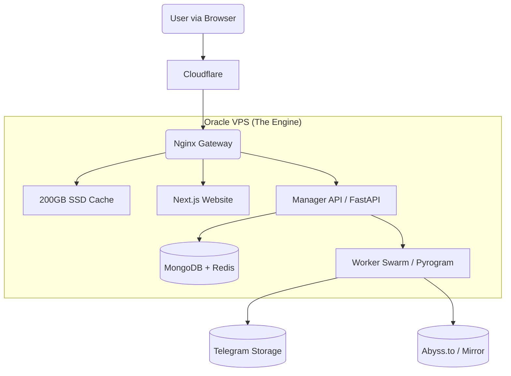

### 📄 File 1: `README.md`

# 🎬 StreamVault Ecosystem
> **The Zero-Cost Enterprise Streaming Network**  
> *Turning "Always Free" Cloud Infrastructure into a Netflix-Scale Streaming Service.*

  

---

## 📖 Executive Summary
StreamVault is not just a Telegram Bot. It is a **Microservices-based Content Delivery Network (CDN)** designed to host, index, and stream terabytes of video content using **Telegram** as the backend storage and **Oracle Cloud (Free Tier)** as the Delivery Engine.

Unlike standard bots that throttle users or get banned for flooding, StreamVault utilizes a **"Worker Swarm"** architecture and **Disk Caching** to serve thousands of concurrent users instantly, ensuring stability and revenue generation.

---

## 🏗️ System Architecture
The system runs on a **Single-Node Docker Swarm** (Docker Compose) on an Oracle Ampere A1 server (4 vCPU, 24GB RAM).



### The Three Pillars (Context Documentation)
*Detailed technical specs are separated into domain-specific documentation.*

| Module | Description & Link |
| :--- | :--- |
| **Backend & Infra** | **[See Context File: Infrastructure]** <br> Docker Compose, Nginx Caching Rules, Oracle Network Tunneling, Prometheus Monitoring. |
| **Frontend & UX** | **[See Context File: Frontend]** <br> Next.js Glassmorphism UI, Video Player, Magic Links, Ad-Integration. |
| **Bots & Telegram** | **[See Context File: Telegram]** <br> Manager Logic, Leech Ingestion, Worker Swarm Rotation, Abuse Handling. |

---

## ✨ Key Features (The Competitive Edge)

### 💰 Monetization & Growth
- [x] **Ad-Supported Player:** Smart Pop-under and Link Shortener integration.
- [x] **Instant Streaming:** **Nginx Slice Caching** allows popular movies to load instantly from disk, bypassing Telegram API.
- [x] **SEO Optimized:** Auto-generated Sitemaps and Rich Snippets (JSON-LD) for organic Google traffic.

### 🛡️ Safety & Stability
- [x] **Worker Swarm:** Loads are balanced across 10+ Telegram accounts to prevent "Flood Wait" bans.
- [x] **Obfuscated Network:** Traffic is masked via Cloudflare and internal proxying; End-users never interact with Telegram directly.
- [x] **Kill Switch:** Admin command `/takedown` instantly purges content from DB, Cache, and Source channels for DMCA compliance.

### 🎥 User Experience
- [x] **Glassmorphism UI:** Premium, app-like Dark Mode interface with fluid animations.
- [x] **Multi-Quality Buckets:** 4K, 1080p, and 720p versions aggregated under a single movie title.
- [x] **Stream-Zipping:** "Download Season Pack" buttons that zip 20 episodes on-the-fly without occupying server storage.

---

This is the structured taxonomy for our documentation. Since we have successfully fixed **Phase 1 (V1)**, these context files now strictly define **Phase 2 (The Oracle Migration)**.

---

### 📂 Phase 2: The Enterprise Upgrade (Oracle Cloud)

#### 1️⃣ The Bedrock
*   **Filename:** `context_01_infrastructure.md`
*   **Phase Title:** **Phase 2.1: Cloud Infrastructure & Microservice Swarm**
*   **Role:** Defines the Oracle A1 VPS setup, Docker Compose architecture, Nginx Caching rules, Security tunnels (Cloudflare), and the Monitoring Stack (Grafana/Prometheus).

#### 2️⃣ The Engine
*   **Filename:** `context_02_telegram_logic.md`
*   **Phase Title:** **Phase 2.2: Telegram Ecosystem (Manager & Worker Swarm)**
*   **Role:** Defines the application logic—Manager Bot features (Auth, Abuse, Metadata), Worker Bot swarming (Load Balancing), Ingestion (Leeching/Zipping), and Database schemas (Mongo/Redis).

#### 3️⃣ The Interface
*   **Filename:** `context_03_frontend_ux.md`
*   **Phase Title:** **Phase 2.3: Web Experience & Monetization**
*   **Role:** Defines the Next.js visual layer—Glassmorphism UI, Video Player interactions, "Bucket" Downloads, Ad integration, and SEO automation.

---

### 📝 "Roadmap" section:

> **Phase 2: Oracle Cloud Migration (Active)**
> *   [📄 Blueprint 2.1: Infrastructure & Docker Architecture](./docs/v2_blueprint/context_01_infrastructure.md)
> *   [📄 Blueprint 2.2: Telegram Microservices Logic](./docs/v2_blueprint/context_02_telegram_logic.md)
> *   [📄 Blueprint 2.3: Frontend Web Experience](./docs/v2_blueprint/context_03_frontend_ux.md)

## 🚀 Deployment Guide (Zero to Hero)

### Prerequisites
1.  **Oracle Cloud Account:** Approved "Always Free" account (Home Region: Singapore/Frankfurt/Jeddah recommended).
2.  **Domain Name:** Linked to Cloudflare (e.g., `streamvault.xyz` or `.eu.org`).
3.  **Telegram Accounts:** 5-10 spare accounts (Physical SIM recommended).

### Step 1: Infrastructure Setup
```bash
# SSH into your new Oracle Instance
ssh ubuntu@your-ip-address

# Update & Install Docker
sudo apt update && sudo apt upgrade -y
curl -fsSL https://get.docker.com -o get-docker.sh
sh get-docker.sh
```

### Step 2: Deployment
```bash
# Clone the Repository
git clone https://github.com/YourRepo/streamvault.git /app/streamvault

# Configure Environment
cd /app/streamvault
cp .env.example .env
nano .env # (Paste your Bot Tokens, Mongo URL, TMDB Keys)

# Launch the Swarm
docker compose up -d --build
```

### Step 3: Initialization
1.  Send `/login` to your Manager Bot.
2.  Click the **Magic Link**.
3.  You are now the **Super Admin**. Access `streamvault.net/admin` to verify system health.

---

## ❓ Frequently Asked Questions (Business Risks)

**Q: Can Oracle delete my server?**
> A: As long as the server shows active usage (CPU/RAM > 10%), it is considered active. StreamVault's architecture ensures constant "Healthy Activity."

**Q: What happens if a DMCA notice arrives?**
> A: Use the `/takedown` command. It surgically removes the content from our Cache and Database. Reply to the email confirming removal. Do not ignore it.

**Q: How do I backup my database?**
> A: The system runs a daily Cron Job that dumps MongoDB data to a Private Telegram Channel. If the server dies, you can restore your library on a new VPS in minutes.

---

## 📜 License
*Proprietary Source-Available.*  
Designed for educational and research purposes.
```

---

### 🤖 File 2: `AI_GENERATION_PROMPT.md`

*Copy the text below when starting a new chat with an AI coder (ChatGPT/Claude/DeepSeek) to build this project.*

```markdown
# 🤖 System Prompt for StreamVault Development
**Role:** Senior DevOps Architect & Full-Stack Python Developer.
**Objective:** Assist the user in generating the code for "StreamVault," a high-scale Telegram Streaming Ecosystem hosted on Oracle Cloud.

---

### 1. THE CONTEXT (Your Brain)
The project is split into 3 distinct logical domains. The user will provide the specific **Context File** for the module we are currently building.
*   **Context_Infra:** Docker Swarm, Nginx Configs, Monitoring.
*   **Context_Frontend:** Next.js, Tailwind, Glass UI.
*   **Context_Telegram:** Pyrogram Bots, Ingestion Logic.

**Your constraints for every code generation:**
1.  **Architecture:** Always strictly follow the **"Manager -> Worker -> Storage"** separation. Never put download logic in the Manager Bot.
2.  **Platform:** Optimize for **Oracle Ampere A1 (ARM64)**.
    *   *Docker:* Use `linux/arm64` base images where applicable.
    *   *Threads:* Utilize the 4 cores via `asyncio` loop efficiency.
3.  **Storage:** All "Persistent" data (Sessions, DB, Cache) **MUST** allow mounting to the `/data` Host Volume.
    *   *Permission:* Ensure `Dockerfile` includes `RUN chown -R 1000:1000` logic.

### 2. CODE QUALITY RULES
*   **Tokens:** Be efficient. Do not explain basic concepts ("Here is how imports work"). Just output the solution.
*   **Placeholders:** Use `placehold.co` for images. Use `YOUR_IP` / `YOUR_TOKEN` for secrets.
*   **Error Handling:** Every API route must include a `try/except` block that fails gracefully (e.g., logging to Telegram Admin Channel instead of crashing stdout).

### 3. THE "BUSINESS" LOGIC (Implicit)
Always code with these business rules in mind:
*   **Safety:** Do not leak Telegram IPs. Use Nginx Proxying for images/video.
*   **Revenue:** Ensure logic exists to inject "Ad Scripts" or "Shortener Checks" in the download routes.
*   **Growth:** SEO Metadata (Sitemaps) should be auto-generated from DB.

---
