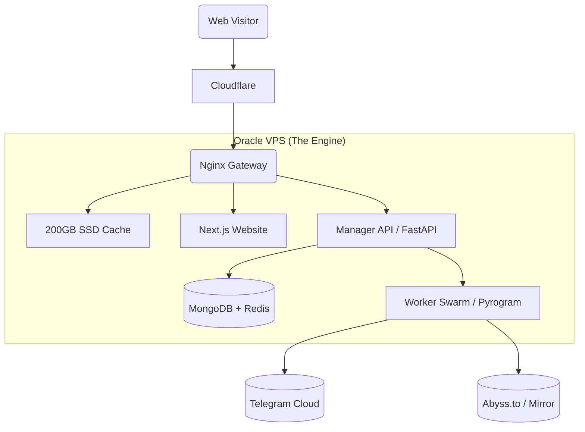

### 📂 File 1: `README.md`
*(Updated with V1 context and strict phase links)*

# 🎬 StreamVault Ecosystem (V2)
> **The Zero-Cost Enterprise Streaming Network**  
> *Turning "Always Free" Cloud Infrastructure into a Netflix-Scale Streaming Service.*

  

---

## 📖 Executive Summary
StreamVault is a microservices-based **Content Delivery Network (CDN)** designed to host, index, and stream terabytes of video content using **Telegram** as unlimited backend storage and **Oracle Cloud (Free Tier)** as the high-speed delivery engine.

Unlike standard Telegram bots, StreamVault separates the **Application Logic** (Manager) from the **Heavy Lifting** (Worker Swarm), utilizing a custom **Nginx Slice Caching** layer to serve viral content directly from disk—saving bandwidth and preventing API bans.

---

## 🏗️ System Architecture
The system runs as a **Single-Node Docker Cluster** (Docker Compose) on an Oracle Ampere A1 server (4 vCPU, 24GB RAM).



---

## 🗺️ Project Roadmap & Blueprints
The project documentation is split into three specific architectural domains. **Refer to these files in the `docs/` folder before starting development.**

### **Phase 2: Oracle Cloud Migration (Active)**

#### 🧱 [Blueprint 2.1: Infrastructure & Backend](./docs/new_v2_blueprint/context_01_infrastructure.md)
> *The Engine Room.* Details the Docker Compose setup, Nginx Slice Caching rules, Prometheus Monitoring, and Security Tunnels (Cloudflare).

#### 🔭 [Blueprint 2.2: Frontend Web Experience](./docs/new_v2_blueprint/context_02_frontend_ux.md)
> *The User Experience.* Covers the Next.js Glassmorphism UI, Video Player interactions (Soft Subtitles, Shortcuts), Authentication (Magic Links/QR), and Ad-Revenue logic.

#### 🤖 [Blueprint 2.3: Telegram Microservices](./docs/new_v2_blueprint/context_03_telegram_logic.md)
> *The Logic Core.* Explains the Manager Bot (Admin), Worker Swarm (Load Balancing), Ingestion Pipelines (Leech/Zip), and Abuse Handling systems.

*(Note: Phase 1 Legacy Code is deprecated. V2 is a full architectural rewrite).*

---

## ✨ Competitive Edge (Features)

### 💰 Monetization & Growth
- **Public First Model:** Users can watch as "Guests" (monetized via Ads) or log in via Telegram for Premium perks.
- **Referral Viral Loop:** Built-in system where users invite friends to unlock 4K quality/Premium speeds.
- **SEO Automation:** Automated Sitemaps and JSON-LD Rich Snippets for organic Google traffic.

### 🛡️ Safety & Stability
- **Swarm Rotation:** Downloads are load-balanced across 10+ Worker Sessions to prevent Telegram Flood Bans.
- **White-Label Proxy:** All traffic (Images/Video) is proxied through the API; users/trackers never see Telegram URLs.
- **Global Kill Switch:** `/takedown [ID]` command instantly purges content from Database, Nginx Cache, and Source Channel for DMCA compliance.

### 🎥 The Experience
- **"Obsidian Glass" UI:** A modern, dark-mode interface with blurry glass aesthetics.
- **Multi-Quality Buckets:** Aggregates 4K, 1080p, and 720p files under a single Movie Title.
- **On-The-Fly Zipping:** Users can download "Season Packs" (20GB+) as a single zip file generated in real-time.

---

## 🚀 Quick Deployment (Oracle OCI)

### Prerequisites
1.  **Oracle Cloud Account** (Always Free Tier - Ampere A1).
2.  **Domain Name** linked to Cloudflare DNS.
3.  **10+ Telegram Accounts** (Session Strings) for the Worker Swarm.

### Installation
```bash
# 1. Access the VPS
ssh ubuntu@your-oracle-ip

# 2. Clone Repo
git clone https://github.com/YourName/streamvault-v2.git /app/streamvault
cd /app/streamvault

# 3. Permissions (Critical for Mongo/Nginx)
sudo chown -R 1000:1000 data/

# 4. Config
cp .env.example .env
nano .env

# 5. Ignite the Swarm
docker compose up -d --build
```

### Initial Setup
1.  Send `/login` to your Manager Bot to get the Super Admin Magic Link.
2.  Use the `/import` command (if applicable) to sync legacy channels.
3.  Add your Worker Session strings to `config/workers/`.

---

## 📜 License
*Proprietary Source-Available Software.*  
Designed for educational research on High-Load Telegram Systems.
